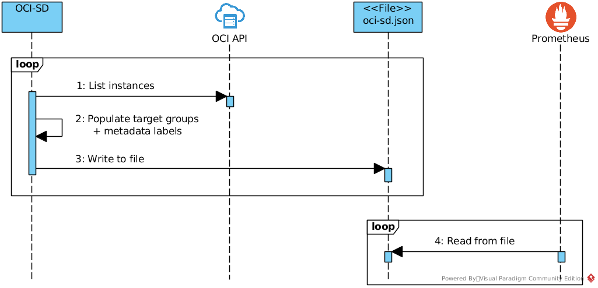

# OCI Service Discovery

[Prometheus](https://github.com/prometheus/prometheus) service discovery for OCI ([Oracle Cloud Infrastructure](https://cloud.oracle.com/iaas)).

## How it works

Unfortunately, _Prometheus_ team [doesn't accept new service discovery
integrations](https://github.com/prometheus/prometheus/issues/4322#issuecomment-401828508) in the _Prometheus_
code base. Instead, they propose to use [file
SD](https://prometheus.io/docs/prometheus/latest/configuration/configuration/#%3Cfile_sd_config%3E) integration.
Therefore, _OCI Service Discovery_ works in following manner:

As should be obvious from the diagram, synchronization of monitored targets (i.e. OCI instances) happens via shared
`oci-sd.json` file (the file name can be arbitrary):

1. _OCI-SD_ periodically provides this file
1. _Prometheus_ periodically consumes it.

Please note, that those discoveries/scrapings are independent of each other.

## How to use it

OCI-SD can be used in two ways: either as a standalone, CLI application, or as a _Golang_ package which can
be imported to your application.

### A standalone application

qwer

### Golang package

qwer

## Configuration

TBD

## Metadata labels

TBD

## Example

TBD

## License

The **oci-sd** application and the **oci** package are published under
[BSD 3-Clause](http://opensource.org/licenses/BSD-3-Clause) license.

The **adapter** package is published under [Apache 2.0](http://www.apache.org/licenses/LICENSE-2.0) license.
